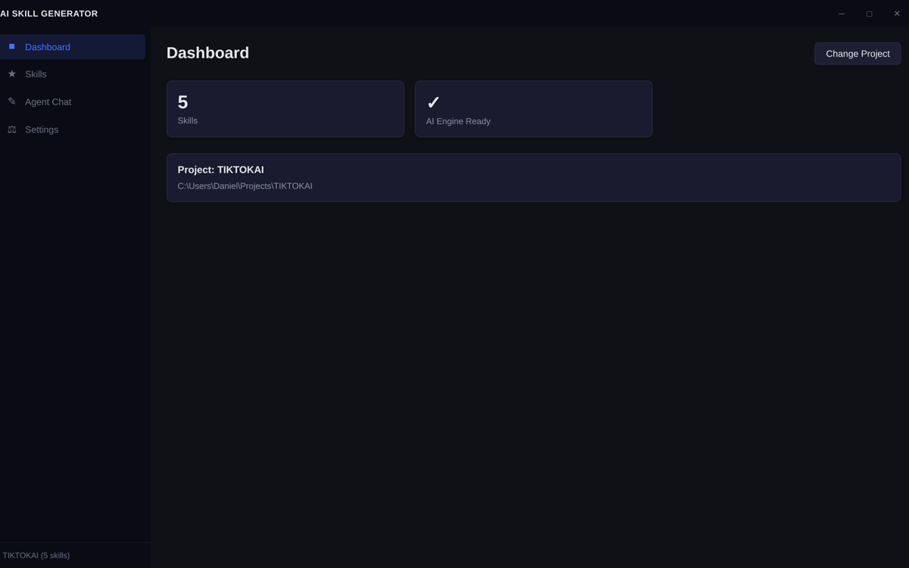

<p align="center"></p>

<p align="center">
  
  
  
  <a href="../../releases/latest"></a>
</p>

# AI Skill Generator

Desktop app to create and manage skills for AI coding agents — and chat with the agent — from a visual interface, no terminal required.

Built with **Tauri 2** and a native **Rust** backend. The app started life as an Electron project (preserved in the [`electron`](../../tree/electron) branch) and was fully migrated to Tauri for much lighter binaries and a smaller memory footprint.



## Download

Grab the Windows installer from the [latest release](../../releases/latest), or build from source (see below).

## Features

- **Dashboard** — project and AI engine status at a glance.
- **Skills manager** — view, create, edit and delete agent skills with instant search. Generated skills follow the `SKILL.md` format, compatible with Claude Code, Cursor, Codex CLI, Gemini CLI, GitHub Copilot, Windsurf and more.
- **Agent Chat** — talk to the coding agent directly from the app, with real-time streaming output.
- **Settings** — dark mode, project switching, and guided AI engine installation with live progress.
- **Self-updating** — checks GitHub for a newer version on startup.

## Architecture

- **Backend (Rust)**: Tauri commands handle all system access — process management with Tokio, engine download and extraction (reqwest + flate2/tar), file I/O. Agent output streams to the UI through Tauri events.
- **Frontend**: vanilla JavaScript, HTML and CSS — no frameworks, no build step — with a frameless window and custom title bar.
- **Security**: the frontend can only invoke the small API the backend explicitly exposes.

## Development

```bash
npm install
npm run tauri dev
```

## Build

```bash
npm run tauri build
```

Requires [Rust](https://rustup.rs/) and the [Tauri prerequisites](https://tauri.app/start/prerequisites/) for your platform.
